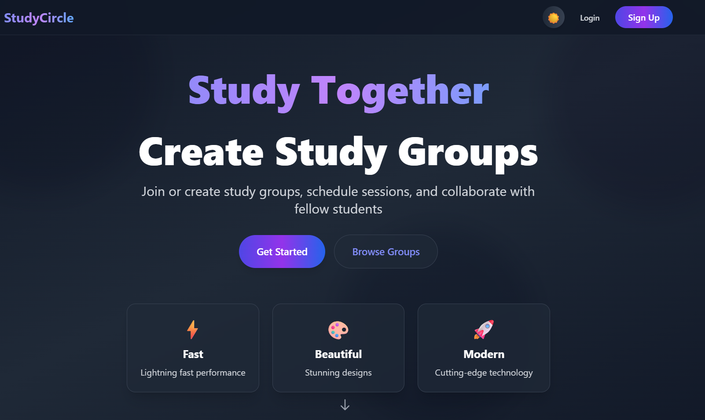
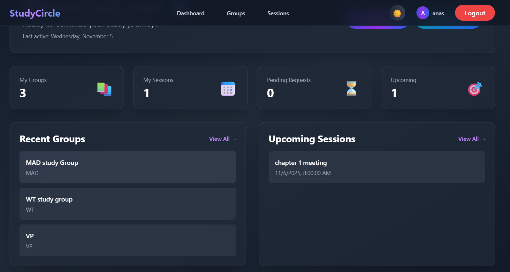
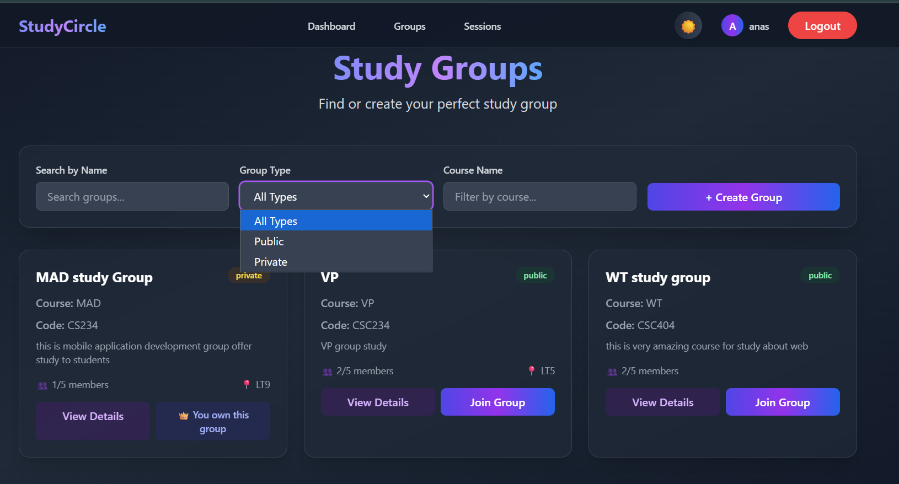
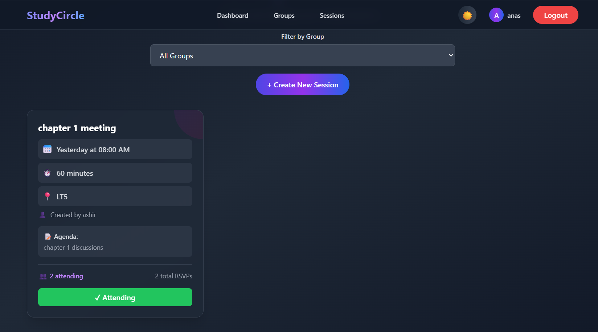
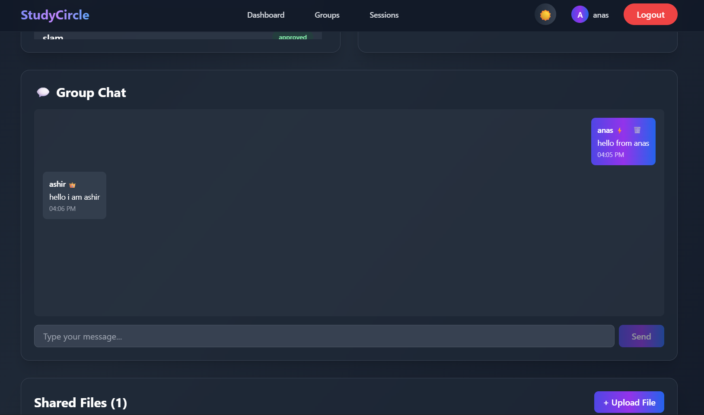
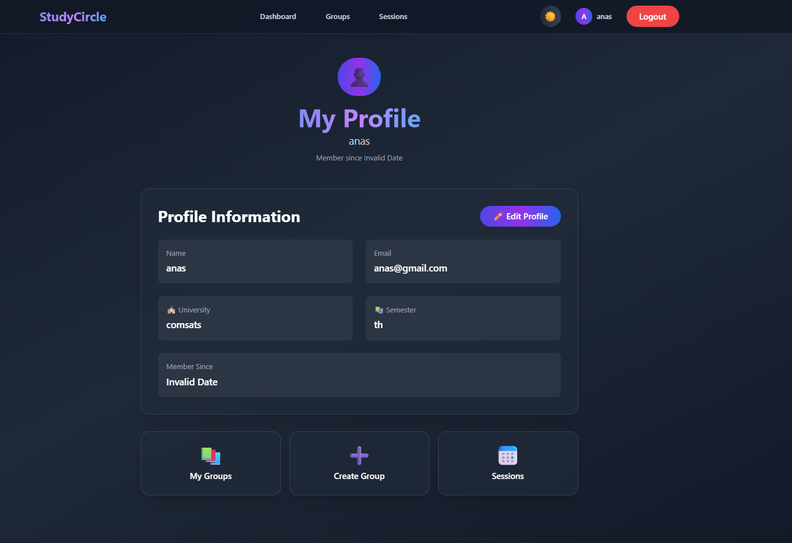
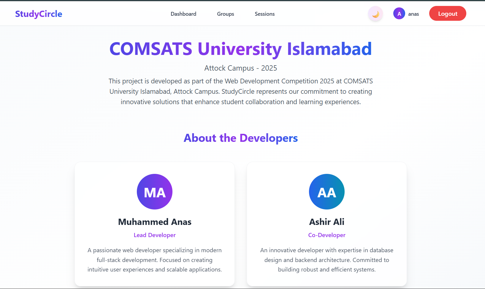

# 🎓 StudyCircle - Study Group Collaboration Platform

<div align="center">


**A modern, full-stack web application for students to create study groups, schedule sessions, collaborate, and share resources.**

**Developed by:** Muhammad Anas & Ashir Ali  
**Institution:** COMSATS University Islamabad, Attock Campus  
**Competition:** COMSATS University Islamabad Web Competition 2025

[](https://reactjs.org/)
[](https://nodejs.org/)
[](https://www.postgresql.org/)
[](https://tailwindcss.com/)

</div>

---

## 📋 Table of Contents

- [Overview](#overview)
- [Developers](#developers)
- [Tech Stack](#tech-stack)
- [Features](#features)
- [Prerequisites](#prerequisites)
- [Database Setup](#database-setup)
- [Installation & Setup](#installation--setup)
- [How to Run](#how-to-run)
- [Usage Guide](#usage-guide)
- [Test Credentials](#test-credentials)
- [API Endpoints](#api-endpoints)
- [Project Structure](#project-structure)
- [Screenshots](#screenshots)
- [Contributing](#contributing)
- [License](#license)

---

## 🎯 Overview

**StudyCircle** is a comprehensive study group collaboration platform designed to help students connect, organize study sessions, share resources, and collaborate effectively. The platform features role-based access control, real-time chat, file sharing, session management, and a beautiful, responsive user interface with dark/light theme support.

### Key Highlights

- 🎨 **Modern UI/UX** - Beautiful, responsive design with smooth animations
- 🔐 **Secure Authentication** - Password hashing with bcryptjs
- 👥 **Role-Based Access** - Owner, Admin, Moderator, and Member roles
- 💬 **Real-Time Chat** - Group chat with auto-refresh
- 📁 **File Sharing** - Upload and share PDFs, documents, and images
- 📅 **Session Management** - Schedule and RSVP to study sessions
- 🌓 **Theme Support** - Dark and light mode toggle
- 📱 **Responsive Design** - Works seamlessly on all devices

---

## 👨‍💻 Developers

### Muhammad Anas

- **Role:** Backend Developer & Database Architect
- **Focus:** API development, database design, server-side logic, security implementation
- **Email:** m13211911@gmail.com

### Ashir Ali

- **Role:** Frontend Developer & UI/UX Designer
- **Focus:** React development, UI design, animations, user experience
- **Email:** m13211911@gmail.com

---

## 🛠️ Tech Stack

### Frontend

- **React 18.2.0** - Modern UI library
- **React Router DOM 6.20.0** - Client-side routing
- **Tailwind CSS 3.3.6** - Utility-first CSS framework
- **Framer Motion 10.16.16** - Animation library
- **Vite 5.0.8** - Fast build tool and dev server

### Backend

- **Node.js** - JavaScript runtime
- **Express.js 4.18.2** - Web framework
- **PostgreSQL** - Relational database
- **bcryptjs 2.4.3** - Password hashing
- **jsonwebtoken 9.0.2** - Authentication tokens
- **multer 1.4.5** - File upload handling
- **pg 8.11.3** - PostgreSQL client

### Development Tools

- **Concurrently 8.2.2** - Run multiple commands simultaneously
- **Nodemon 3.0.2** - Auto-restart server on changes
- **dotenv 16.3.1** - Environment variable management

---

## ✨ Features

### Core Features

#### 1. **User Management** 👤

- User registration with email validation
- Secure login with password hashing
- User profiles with editable information
- Profile picture support
- University and semester information

#### 2. **Study Groups** 👥

- Create public or private study groups
- Group capacity: 3-10 members
- Group filtering (by name, type, course)
- Group details with member list
- Join requests for private groups
- Approval/rejection system

#### 3. **Role-Based Access Control** 👑

- **Owner**: Full control over group
  - Edit/delete group
  - Manage members (approve/reject)
  - Assign roles (admin, moderator)
  - Upload/delete files
  - Create/edit/delete sessions
- **Admin**: Advanced permissions
  - Upload files
  - Create sessions
  - Delete files
  - Manage content
- **Moderator**: Content management
  - Upload files
  - Create sessions
- **Member**: Basic access
  - View group content
  - Participate in chat
  - RSVP to sessions

#### 4. **Session Management** 📅

- Create study sessions with:
  - Title and description
  - Date and time
  - Duration
  - Location
  - Agenda
- RSVP system (Attending, Maybe, Not Attending)
- Session filtering by group
- Edit and delete sessions
- Attendance tracking

#### 5. **File Sharing** 📁

- Upload files (PDF, images, documents)
- File descriptions
- Download shared files
- File management (delete for owners/admins)
- File type validation

#### 6. **Group Chat** 💬

- Real-time messaging (3-second auto-refresh)
- Role badges on messages (👑 Owner, ⚡ Admin, 🛡️ Moderator)
- Message timestamps
- Delete messages (own messages or by owner/admin)
- Beautiful UI with gradient message bubbles
- Auto-scroll to latest messages

#### 7. **Dashboard** 📊

- Overview of user's groups
- Upcoming sessions
- Pending membership requests
- Quick statistics
- Recent activity

#### 8. **Notifications** 🔔

- New session notifications
- Membership approval notifications
- System notifications

### Bonus Features

#### 9. **Dark/Light Theme** 🌓

- Toggle between dark and light modes
- Theme persistence
- Smooth transitions
- Professional color schemes

#### 10. **Responsive Design** 📱

- Mobile-first approach
- Works on all screen sizes
- Touch-friendly interface
- Optimized for tablets and desktops

#### 11. **Search & Filter** 🔍

- Search groups by name
- Filter by type (public/private)
- Filter by course name
- Filter sessions by group

#### 12. **Animations & UI Polish** 🎨

- Smooth page transitions
- Loading skeletons
- Toast notifications
- Confirmation modals
- Hover effects
- Gradient backgrounds

#### 13. **User Experience** ✨

- Welcome messages for logged-in users
- Empty states with helpful messages
- Error handling with user-friendly messages
- Loading states
- Form validation

---

## 📦 Prerequisites

Before you begin, ensure you have the following installed:

- **Node.js** (v16 or higher) - [Download](https://nodejs.org/)
- **PostgreSQL** (v12 or higher) - [Download](https://www.postgresql.org/download/)
- **npm** or **yarn** - Comes with Node.js
- **pgAdmin** (optional) - For database management - [Download](https://www.pgadmin.org/)

---

## 🗄️ Database Setup

### Step 1: Create Database

1. Open **pgAdmin** or PostgreSQL command line
2. Create a new database named `study_circle`:

```sql
CREATE DATABASE study_circle;
```

### Step 2: Run Schema Scripts

Execute the following SQL scripts in **order** using pgAdmin Query Tool:

#### 2.1 Main Schema

```sql
-- Run: server/database/schema.sql
-- This creates:
--   - users table
--   - groups table
--   - memberships table
--   - sessions table
--   - rsvps table
```

#### 2.2 Role Column

```sql
-- Run: server/database/add_role_to_memberships.sql
-- This adds role column to memberships table
```

#### 2.3 Files Table

```sql
-- Run: server/database/add_files_table.sql
-- This creates group_files table for file sharing
```

#### 2.4 Notifications Table

```sql
-- Run: server/database/add_notifications_table.sql
-- This creates notifications table
```

#### 2.5 Chat Messages Table

```sql
-- Run: server/database/add_chat_messages_table.sql
-- This creates group_messages table for group chat
```

### Step 3: Verify Tables

Run this query to verify all tables are created:

```sql
SELECT table_name
FROM information_schema.tables
WHERE table_schema = 'public'
ORDER BY table_name;
```

You should see:

- `users`
- `groups`
- `memberships`
- `sessions`
- `rsvps`
- `group_files`
- `notifications`
- `group_messages`

---

## 🚀 Installation & Setup

### Step 1: Clone the Repository

```bash
git clone <repository-url>
cd "Web Compitition"
```

### Step 2: Install Dependencies

```bash
npm install
```

### Step 3: Environment Configuration

Create a `.env` file in the root directory:

```env
# Database Configuration
DB_USER=postgres
DB_HOST=localhost
DB_NAME=study_circle
DB_PASSWORD=your_postgres_password
DB_PORT=5432

# Server Configuration
PORT=5000

# JWT Secret (use a strong random string)
JWT_SECRET=your-super-secret-jwt-key-change-this-in-production

# Frontend URL (for CORS)
FRONTEND_URL=http://localhost:5173
```

**⚠️ Important:** Replace `your_postgres_password` with your actual PostgreSQL password and change `JWT_SECRET` to a secure random string.

### Step 4: Create Uploads Directory

The uploads directory will be created automatically, but you can create it manually:

```bash
mkdir server/uploads
```

---

## ▶️ How to Run

### Development Mode (Recommended)

Run both frontend and backend concurrently:

```bash
npm start
```

This will start:

- **Frontend:** http://localhost:5173
- **Backend:** http://localhost:5000

### Run Separately

**Frontend only:**

```bash
npm run dev
```

**Backend only:**

```bash
npm run server
```

### Production Build

```bash
npm run build
npm run preview
```

---

## 📖 Usage Guide

### 1. Registration

1. Navigate to the home page
2. Click **"Sign Up"** or **"Get Started"**
3. Fill in the registration form:
   - Name
   - Email (must be unique)
   - Password (min 6 characters)
   - University (optional)
   - Semester (optional)
4. Click **"Register"**
5. You'll be automatically logged in

### 2. Creating a Group

1. Login to your account
2. Click **"Groups"** in the navbar
3. Click **"+ Create New Group"**
4. Fill in the form:
   - Group Name (required)
   - Course Name (required)
   - Course Code (optional)
   - Description (optional)
   - Max Capacity (3-10 members)
   - Group Type (Public or Private)
   - Meeting Schedule (optional)
   - Meeting Location (optional)
5. Click **"Create Group"**

### 3. Joining a Group

**For Public Groups:**

1. Browse groups on the Groups page
2. Click **"Join Group"** on any public group
3. You'll be automatically added

**For Private Groups:**

1. Browse groups on the Groups page
2. Click **"Request to Join"** on any private group
3. Wait for the owner to approve your request
4. You'll receive a notification when approved

### 4. Managing Group Members (Owner)

1. Go to your group's detail page
2. In the Members section, you'll see:
   - **Pending Requests**: Approve or reject
   - **Approved Members**: Change their roles (Admin, Moderator, Member)
3. Use the dropdown to assign roles

### 5. Creating a Session

1. Navigate to **"Sessions"** or go to a group's detail page
2. Click **"+ Create New Session"**
3. Select a group (only groups where you're Owner/Admin/Moderator)
4. Fill in session details:
   - Title (required)
   - Date & Time (required)
   - Duration in minutes (required)
   - Location (optional)
   - Agenda (optional)
5. Click **"Create Session"**

### 6. RSVP to Sessions

1. Go to **"Sessions"** page
2. Click on a session card
3. Choose your RSVP status:
   - **Attending** - You'll be there
   - **Maybe** - You might attend
   - **Not Attending** - You won't attend

### 7. File Sharing

1. Go to a group's detail page
2. Scroll to **"Shared Files"** section
3. Click **"+ Upload File"** (Owner/Admin only)
4. Select a file (PDF, images, documents)
5. Add a description (optional)
6. Click **"Upload File"**
7. Members can download files by clicking **"Download →"**

### 8. Group Chat

1. Go to a group's detail page
2. Scroll to **"Group Chat"** section
3. Type your message in the input box
4. Press **"Send"** or Enter
5. Messages auto-refresh every 3 seconds
6. You can delete your own messages
7. Owners/Admins can delete any message

### 9. Profile Management

1. Click on your name/avatar in the navbar
2. Click **"Profile"**
3. Edit your information:
   - Name
   - Email
   - University
   - Semester
   - Profile Picture
4. Click **"Update Profile"**

### 10. Theme Toggle

- Click the moon/sun icon in the navbar
- Toggle between dark and light mode
- Theme preference is saved

---

## 🔐 Test Credentials

We've created test accounts for you to explore the system:

### Account 1: Anas

- **Email:** anas@test.com
- **Password:** anas123
- **Role:** Can create groups, become admin/moderator

### Account 2: Ashir

- **Email:** ashir@test.com
- **Password:** ashir123
- **Role:** Can create groups, become admin/moderator

### Account 3: Salam

- **Email:** salam@test.com
- **Password:** salam123
- **Role:** Can create groups, become admin/moderator

**Testing Scenarios:**

1. **Create Groups:**

   - Login as Anas
   - Create a public group
   - Create a private group

2. **Join Groups:**

   - Login as Ashir
   - Join Anas's public group
   - Request to join Anas's private group

3. **Approve Members:**

   - Login as Anas
   - Go to private group
   - Approve Ashir's request
   - Make Ashir an Admin

4. **Admin Features:**

   - Login as Ashir
   - Go to the group where you're admin
   - Upload a file
   - Create a session

5. **Chat:**

   - Login as multiple users
   - Go to the same group
   - Send messages in chat
   - Test message deletion

6. **Sessions:**
   - Create a session as Owner/Admin
   - RSVP as different users
   - Check attendance count

---

## 🔌 API Endpoints

### Users

- `POST /api/users/register` - Register new user
- `POST /api/users/login` - Login user
- `GET /api/users` - Get all users
- `GET /api/users/:id` - Get user by ID
- `PUT /api/users/:id` - Update user
- `DELETE /api/users/:id` - Delete user

### Groups

- `GET /api/groups` - Get all groups (with filters)
- `GET /api/groups/:id` - Get group by ID
- `POST /api/groups` - Create group
- `PUT /api/groups/:id` - Update group
- `DELETE /api/groups/:id` - Delete group

### Memberships

- `GET /api/memberships/group/:groupId` - Get group members
- `GET /api/memberships/user/:userId` - Get user's groups
- `POST /api/memberships` - Join group / Request to join
- `PUT /api/memberships/:id` - Update membership (approve, change role)
- `DELETE /api/memberships/:id` - Leave group / Reject request

### Sessions

- `GET /api/sessions/group/:groupId` - Get group sessions
- `GET /api/sessions/:id` - Get session by ID
- `POST /api/sessions` - Create session
- `PUT /api/sessions/:id` - Update session
- `DELETE /api/sessions/:id` - Delete session

### RSVPs

- `GET /api/rsvps/user/:userId/session/:sessionId` - Get user's RSVP
- `POST /api/rsvps` - Create/Update RSVP
- `GET /api/rsvps/session/:sessionId` - Get all RSVPs for session

### Files

- `GET /api/files/group/:groupId` - Get group files
- `POST /api/files/upload` - Upload file (multipart/form-data)
- `DELETE /api/files/:id` - Delete file

### Messages (Chat)

- `GET /api/messages/group/:groupId` - Get group messages
- `POST /api/messages` - Send message
- `DELETE /api/messages/:id` - Delete message

### Notifications

- `GET /api/notifications/user/:userId` - Get user notifications
- `PUT /api/notifications/:id/read` - Mark as read

---

## 📁 Project Structure

```
Web Compitition/
├── src/                          # React frontend
│   ├── components/              # Reusable components
│   │   ├── AboutSection.jsx     # About us section
│   │   ├── AnimatedSection.jsx  # Animation wrapper
│   │   ├── ConfirmModal.jsx     # Confirmation dialogs
│   │   ├── FeatureCards.jsx    # Feature showcase
│   │   ├── Footer.jsx           # Footer component
│   │   ├── GroupChat.jsx        # Group chat component
│   │   ├── Hero.jsx             # Hero section
│   │   ├── LoadingSkeleton.jsx   # Loading states
│   │   ├── ModernNavbar.jsx     # Navigation bar
│   │   └── Toast.jsx            # Toast notifications
│   ├── contexts/                # React contexts
│   │   ├── ThemeContext.jsx     # Theme management
│   │   └── ToastContext.jsx     # Toast notifications
│   ├── pages/                   # Page components
│   │   ├── CreateGroup.jsx      # Create group page
│   │   ├── CreateSession.jsx    # Create session page
│   │   ├── Dashboard.jsx        # User dashboard
│   │   ├── EditGroup.jsx        # Edit group page
│   │   ├── EditSession.jsx      # Edit session page
│   │   ├── GroupDetail.jsx      # Group details page
│   │   ├── Groups.jsx           # Groups listing page
│   │   ├── Login.jsx            # Login page
│   │   ├── Profile.jsx          # User profile page
│   │   ├── Register.jsx         # Registration page
│   │   └── Sessions.jsx         # Sessions listing page
│   ├── utils/                   # Utility functions
│   │   └── dateFormatter.js     # Date formatting
│   ├── App.jsx                  # Main app component
│   ├── index.css               # Global styles
│   └── main.jsx                # Entry point
├── server/                      # Express backend
│   ├── config/                 # Configuration
│   │   └── database.js         # Database connection
│   ├── database/               # SQL scripts
│   │   ├── schema.sql          # Main schema
│   │   ├── add_role_to_memberships.sql
│   │   ├── add_files_table.sql
│   │   ├── add_notifications_table.sql
│   │   └── add_chat_messages_table.sql
│   ├── routes/                 # API routes
│   │   ├── fileRoutes.js       # File endpoints
│   │   ├── groupRoutes.js      # Group endpoints
│   │   ├── membershipRoutes.js # Membership endpoints
│   │   ├── messageRoutes.js    # Chat endpoints
│   │   ├── notificationRoutes.js # Notification endpoints
│   │   ├── rsvpRoutes.js       # RSVP endpoints
│   │   ├── sessionRoutes.js    # Session endpoints
│   │   └── userRoutes.js       # User endpoints
│   ├── uploads/                # Uploaded files
│   └── index.js               # Server entry point
├── .env                       # Environment variables (create this)
├── package.json              # Dependencies
├── tailwind.config.js        # Tailwind configuration
├── vite.config.js            # Vite configuration
└── README.md                 # This file
```

---

## 📸 Screenshots

### Home Page


_Beautiful landing page with hero section, features, and about section_

### Dashboard


_User dashboard showing groups, sessions, and statistics_

### Groups Page


_Browse and filter study groups_

### Group Detail


_Group details with members, sessions, files, and chat_

### Sessions Page


_View and manage study sessions_

### Chat Interface


_Real-time group chat with role badges_

### Profile Page


_User profile management_

### Dark Mode


_Beautiful dark theme_

> **Note:** Add your screenshots to the `screenshots/` folder and update the paths above.

---

## 🎯 Feature Summary

### Core Features ✅

1. ✅ User Registration & Authentication
2. ✅ Study Group Creation & Management
3. ✅ Public/Private Groups
4. ✅ Join Request System
5. ✅ Session Scheduling
6. ✅ RSVP System
7. ✅ File Sharing
8. ✅ Member Management
9. ✅ Role-Based Access Control
10. ✅ User Dashboard

### Bonus Features ✅

11. ✅ Real-Time Group Chat
12. ✅ Dark/Light Theme Toggle
13. ✅ Responsive Design
14. ✅ Advanced Search & Filtering
15. ✅ Notifications System
16. ✅ Beautiful Animations
17. ✅ Loading States & Skeletons
18. ✅ Toast Notifications
19. ✅ Confirmation Modals
20. ✅ Profile Management
21. ✅ Admin/Moderator Permissions
22. ✅ Session Attendance Tracking

---

## 🐛 Troubleshooting

### Database Connection Error

- Verify PostgreSQL is running
- Check `.env` file has correct credentials
- Ensure database `study_circle` exists
- Check PostgreSQL port (default: 5432)

### Port Already in Use

- Change `PORT` in `.env` file
- Kill process using port 5000: `npx kill-port 5000`
- Or change frontend port in `vite.config.js`

### Module Not Found

- Delete `node_modules` folder
- Delete `package-lock.json`
- Run `npm install` again

### CORS Error

- Check `FRONTEND_URL` in `.env` matches your frontend URL
- Ensure backend CORS is configured correctly

---

## 📝 Notes

- The application uses **localStorage** for session management
- File uploads are stored in `server/uploads/` directory
- Chat messages auto-refresh every 3 seconds
- Maximum file size: 10MB
- Supported file types: PDF, images (JPG, PNG, GIF), documents (DOC, DOCX)

---

## 🤝 Contributing

This project was developed for the COMSATS University Islamabad Web Competition 2025.

For questions or issues, please contact:

- **Email:** m13211911@gmail.com
- **Phone:** 03350579760
- **Location:** COMSATS University Islamabad, Attock Campus

---

## 📄 License

This project is developed for educational purposes as part of the COMSATS University Islamabad Web Competition 2025.

---

## 👏 Acknowledgments

- **COMSATS University Islamabad** for organizing the competition
- **React** and **Express** communities for excellent documentation
- **Tailwind CSS** for the beautiful utility classes
- **Framer Motion** for smooth animations

---

<div align="center">

**Made with ❤️ by Muhammad Anas & Ashir Ali**

**For COMSATS University Islamabad Web Competition 2025**

⭐ Star this repository if you find it helpful!

</div>
